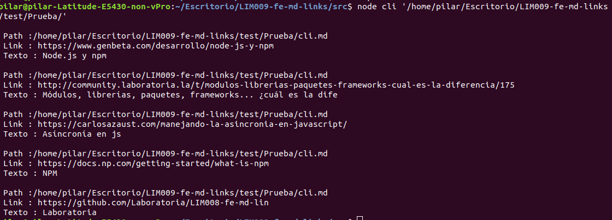

# Markdown Links

## Preámbulo

[Markdown](https://es.wikipedia.org/wiki/Markdown) es un lenguaje de marcado
ligero muy popular entre developers. Es usado en muchísimas plataformas que
manejan texto plano (GitHub, foros, blogs, ...), y es muy común
encontrar varios archivos en ese formato en cualquier tipo de repositorio
(empezando por el tradicional `README.md`).

Estos archivos `Markdown` normalmente contienen _links_ (vínculos/ligas) que
muchas veces están rotos o ya no son válidos y eso perjudica mucho el valor de
la información que se quiere compartir.

Dentro de una comunidad de código abierto, nos han propuesto crear una
herramienta usando [Node.js](https://nodejs.org/), que lea y analice archivos
en formato `Markdown`, para verificar los links que contengan y reportar
algunas estadísticas.


## Descripcion

La librería Markdown Links es una herramienta simple y práctica que extrae, analiza y valida
los links que se encuentren dentro de un archivo de tipo markdown.

## Diagrama de Flujo


### Instalacion
Para poder instalar md-links se debe ejecutar en la terminal la siguiente línea: npm install 


### JavaScript API

El módulo debe poder importarse en otros scripts de Node.js y debe ofrecer la
siguiente interfaz:

#### `mdLinks(path, options)`

##### Argumentos

- `path`: Ruta absoluta o relativa al archivo o directorio. Si la ruta pasada es
  relativa, debe resolverse como relativa al directorio desde donde se invoca
  node - _current working directory_).
- `options`: Un objeto con las siguientes propiedades:
  * `validate`: Booleano que determina si se desea validar los links
    encontrados.

##### Valor de retorno

La función debe retornar una promesa (`Promise`) que resuelva a un arreglo
(`Array`) de objetos (`Object`), donde cada objeto representa un link y contiene
las siguientes propiedades:

- `href`: URL encontrada.
- `text`: Texto que aparecía dentro del link (`<a>`).
- `file`: Ruta del archivo donde se encontró el link.

#### Ejemplo

```js
const mdLinks = require("md-links");

mdLinks("./some/example.md")
  .then(links => {
    // => [{ href, text, file }]
  })
  .catch(console.error);

mdLinks("./some/example.md", { validate: true })
  .then(links => {
    // => [{ href, text, file, status, ok }]
  })
  .catch(console.error);

mdLinks("./some/dir")
  .then(links => {
    // => [{ href, text, file }]
  })
  .catch(console.error);
```

### CLI (Command Line Interface - Interfaz de Línea de Comando)

El ejecutable de nuestra aplicación debe poder ejecutarse de la siguiente
manera a través de la terminal:

`md-links <path-to-file> [options]`

Por ejemplo:

```sh
$ md-links ./some/example.md
./some/example.md http://algo.com/2/3/ Link a algo
./some/example.md https://otra-cosa.net/algun-doc.html algún doc
./some/example.md http://google.com/ Google
```


#### Options

##### `--validate`

Si pasamos la opción `--validate`, el módulo debe hacer una petición HTTP para
averiguar si el link funciona o no. Si el link resulta en una redirección a una
URL que responde ok, entonces consideraremos el link como ok.

Por ejemplo:

```sh13d99df067c1
$ md-13d99df067c1
./some/example.md http://algo.com/2/3/ ok 200 Link a algo
./some/example.md https://otra-cosa.net/algun-doc.html fail 404 algún doc
./some/example.md http://google.com/ ok 301 Google
```


##### `--stats`

Si pasamos la opción `--stats` el output (salida) será un texto con estadísticas
básicas sobre los links.

```sh
$ md-links ./some/example.md --stats
Total: 3
Unique: 3
```


También podemos combinar `--stats` y `--validate` para obtener estadísticas que
necesiten de los resultados de la validación.

```sh
$ md-links ./some/example.md --stats --validate
Total: 3
Unique: 3
Broken: 1
```

